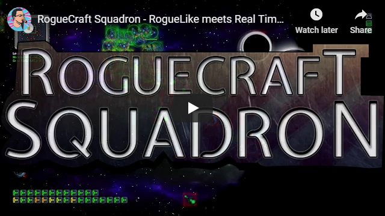
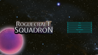
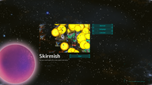
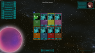
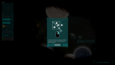
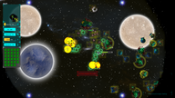
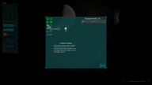
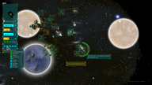
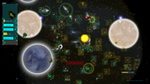

# RogueCraft Squadron Presskit

## Table of Contents

* [Factsheet](#factsheet)
* [About](#about)
* [FAQ](#faq)
* [Missing Sentinel Software Team](#team)

## Factsheet

**Developer:** Missing Sentinel Software ([MissingSentinelSoftware.com](http://MissingSentinelSoftware.com)). Based in Austin, Texas. Founded: October 20, 2011

**Website:** [RogueCraftSquadron.com](http://roguecraftsquadron.com/)

**Release Date:** Early Release: November 2018. Official Release: Q1 2019.

**Platforms:** Windows / Mac / Linux

**Regular Price:** USD $14.99

**Releases:** [Steam](https://store.steampowered.com/app/330687) and [Itch.io](https://josefnpat.itch.io/roguecraft-squadron)

**Press / Business Contact**: [MissingSentinelSoftware@gmail.com](mailto:MissingSenitelSoftware@gmail.com)

**Social:** [twitter.com/MissingSentinel](https://twitter.com/MissingSentinel), [facebook.com/MissingSentinelSoftware](https://www.facebook.com/MissingSentinelSoftware)

**Address:** P.O. Box 200824, 11900 Jollyville Rd, Austin, TX 78720-0824

## About

### Description

RogueCraft Squadron is a fast paced real-time strategy space adventure with roguelike elements. Play as a squadron commander fighting against a hostile alien race; collecting resources, researching new ships and building an armada as you fight to survive against overwhelming odds.

### Features

- Fast paced space-faring RTS. 
- Roguelike gameplay. Death marks the end of your mission.
- Fully featured and customizable Skirmish mode. Includes Co-Op and PvP game types using online multiplayer.
- Build a wide variety of fleets with over 15 different ships to unlock.
- Deep strategy elements. Carefully manage your fleet and resources to defeat your enemies.
- A classic space opera story with art by NoyemiK. 
- Dynamic musical score that changes as you play composed by Ran Schonewille.

### Awards

[LÖVE Jam 2017 - 3rd Place (Original game jam prototype)](https://itch.io/jam/love2d-jam/rate/121472)

### Video Trailer

[Direct Youtube Link](https://www.youtube.com/watch?v=IMLxxkWiuaU)

### Screenshots

  

  

  

### History

#### Early Development

Started out as as a game jam prototype from the LÖVE Jam ([download it here](https://missingsentinelsoftware.com/game/roguecraft-squadron)) in February 2017. The game was a level-based, permadeath, space RTS with the ability to unlock and upgrade your ships.

#### Current

March 2018, after the SXSW Gaming Expo, we decided to pivot the game, going from the level based system to a more open system that would also allow for multiplayer matches. This allowed the game to have configurable maps and expand on the number strategies available to the players. We brought in artist NoyemiK to create character art for the storyline of RogueCraft Squadron, which included humans and aliens. We also brought in composer Ran Schonewille to work on dynamic music tracks. This created a more immersive experience for the player as the music would intensify with conflict and fleet growth.

### Media Kit

[Download: Zip 35.8 MB](MediaKit.zip)

## FAQ

**Is there a demo?** Yep, try it here on [Itch.io!](https://josefnpat.itch.io/roguecraft-squadron)

The demo has a functional multiplayer too!

**Is this the full game?** Yes, but the currently released version is multiplayer mode with more free game modes coming near the end of summer. 

**Is there planned DLC?** Yes, we will be adding more game modes after release, expect them near the end of spring.

**Will any future DLC cost money?** No. It will all be free DLC.

**Where are the new characters created by NoyemiK?** You can see a sneak peak in the lobby, some of the characters are seen there but you’ll have to wait for post release content to discover all of them.

**I like the music, is there a planned OST?** Yep we have an OST on the way.

**How many more game modes should I expect coming?** We plan on releasing two more modes come early spring. This will feature the original prototype with some updates and a new campaign and story mode.

**What happened to the storyline and voice acting?** Don’t worry it’s coming soon, we wanted to spend some more time polishing it before release.

**How many players does this game support?** Up to 8 players, even works on the demo.

**Is there online play?** Yes, online play is available. 

**I’m having issues where can I turn for bug help or support?** Please send an email to:  [missingsentinelsoftware@gmail.com](mailto:missingsentinelsoftware@gmail.com)

**Does this require a keyboard and mouse to play?** Yes, the game requires a keyboard and mouse.

**I’d really like to get in contact to create a interview how can I do so?** Aww, thanks for the support! Please send an email to: [missingsentinelsoftware@gmail.com](mailto:missingsentinelsoftware@gmail.com) 

**Is this a single player game?** You can test your luck against the AI but the game is most fun with other players. We plan on releasing single player content near the end of summer.

**I’d really like a review key, how could I get one?** We’d love to send you one, but we really want to make sure you’re a legitimate review site.

We ask that you send us a photo with a shoe on your head and show us how excited you are about our game, so we can post it on twitter!

Please reach out to us on twitter or send an email to: missingsentinelsoftware@gmail.com

## Missing Sentinel Software Team

**Josef Patoprsty:** Project Manager, Programmer, Writer, UI, Voice Talent

**Ashley Hooper:** 2D Artist, Designer, Project Manager, Marketing

**Ashley Schuster:** Marketing, QA, Playtesting

**Noyemi Karlaite:** Character Art

**Ran Schonewille:** Music

**Arjan Vk:** Voice Talent, Playtesting

**Laura Vk:** Voice Talent